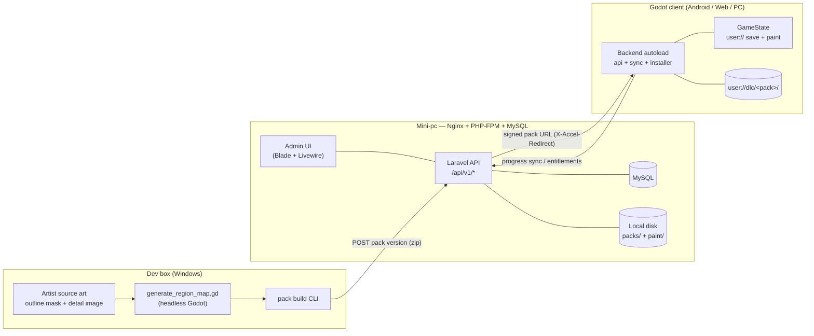
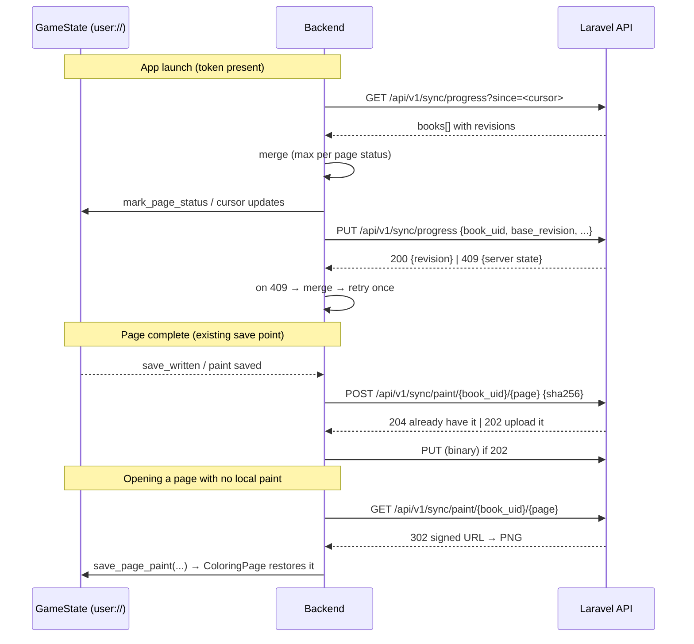
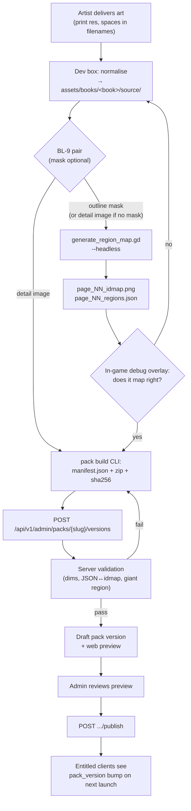

# DLC & Backend Server — Design

Backlog item **BL-8**. Design only; nothing here is implemented yet.

Companion documents: [DESIGN.md](DESIGN.md) (the game), [ANDROID.md](ANDROID.md) (exports),
[BACKLOG.md](BACKLOG.md) (**BL-9** — the outline-mask vs detail-image page split, which this
design depends on).

The server is a **Laravel** app: Nginx + PHP-FPM + MySQL on the Linux mini-pc, the same stack
as the developer's other sites (the game's web build already lives there at
`http://192.168.0.164:91/`). This document assumes that stack and does not re-litigate it.

---

## 1. Goals & non-goals

### Goals

1. **Optional parent-managed accounts.** A grown-up signs up; children never touch an email
   field. The game must remain fully playable with no account at all.
2. **Cloud-synced progress.** A kid who colours the coyote book on the tablet sees that
   progress on the web build, without losing work when two devices disagree.
3. **DLC coloring-book packs.** Buy/claim a pack → it downloads → new books appear on the
   shelf, at runtime, in an exported build (where `res://` is read-only).
4. **An admin flow to publish books.** Upload the artist's source art, attach the mapping
   pipeline's output, preview it, publish it as a pack version.
5. **Offline-first, always.** The local save stays the source of truth for gameplay. The
   network is a background reconciliation, never a gate on a screen.
6. **Solo-developer sized.** One Laravel app, one database, local disk storage, Laravel's
   built-in queue. No microservices, no Kubernetes, no event bus.

### Non-goals

- **No user-generated content, no sharing, no chat, no social graph, no leaderboards.** These
  are the features that turn a kids' app into a compliance project. Deliberately out of scope.
- **No third-party analytics or ad SDKs in the client.** This is the single biggest COPPA
  risk surface and the cheapest one to avoid: don't add it.
- **No server-side rendering of gameplay.** Painting stays entirely client-side.
- **No real-time multiplayer / websockets.** Sync is request/response.
- **No CDN in v1.** One Nginx serving zips off local disk is enough for the expected scale.
- **The server is not the payment processor** on mobile — see §9.
- **No server-side account for a child.** Child profiles are rows under a parent account with
  a nickname and an avatar index, nothing more.

---

## 2. Constraints that actually shape this design

These come from the existing code and are not negotiable without changing it:

| Constraint | Source | Consequence |
|---|---|---|
| `res://` is read-only in exports | Godot | DLC must install into `user://` |
| `BookDef.discover()` scans `res://resources/books/*/book.tres` only | `book_def.gd:79` | Discovery needs a second, `user://`-aware root |
| `PageDef` holds `res://` **paths**, and `PageView.load_page()` calls `load()` on them | `page_def.gd`, `page_view.gd:148` | Runtime PNGs need a texture-injecting overload; `load()` cannot open an unimported `user://` PNG |
| The save is keyed by `BookDef.resource_path` | `game_state.gd:336` `book_key()` | A `res://` path is a terrible cross-device key. Needs a stable `book_uid` — see §6.1 |
| The ID map must stay lossless or region IDs bleed | DESIGN.md §3.2 | Drives the pack format decision in §7.1 |
| `GameState` owns **all** of `user://` | `game_state.gd` header | The pack installer must go *through* `GameState`, not around it |
| Page status is already monotonic and sticky | `game_state.gd:462` `mark_page_status()` | Progress merge is nearly a CRDT for free — see §6.3 |
| A page is ~450–630 KB of shipped art (coyote) | `assets/books/coyote/` | A 12-page pack is ~6–8 MB. Small. No chunked-upload machinery needed |

---

## 3. System overview



Suggested deployment: a sibling Laravel app on the mini-pc, `coloringbook-api`, on its own
port next to the game's port-91 vhost, following whatever the house Nginx + PHP-FPM pattern
already is for the other sites.

---

## 4. Accounts & authentication

### 4.1 The account belongs to a grown-up

- **Registration** requires: email, password, and an explicit "I am the parent or guardian"
  confirmation. No date of birth, no name, no phone. That's the whole PII footprint.
- **Child profiles** live under the account: `nickname` (free text, but never displayed to
  anyone outside the account), `avatar_index` (an integer into a shipped avatar set), and an
  optional coarse `age_band` (`3-5` / `6-8` / `9+`) used only to pick a default difficulty
  mode. No child email, no child password, no child-authored text leaving the device.
- **Adult gate** in the client before any account UI: a simple "type the number twenty-seven"
  / small arithmetic prompt. It is a *deterrent*, not security — its job is to keep a five
  year old out of the sign-in screen, and it is the industry-normal pattern. Reuse the
  existing settings-gear overlay placement from `main.gd`.
- **Parent dashboard** (plain web, no game): manage profiles, see owned packs, revoke device
  tokens, delete the account and all data. Account deletion must be self-serve and must
  actually delete (progress rows, paint blobs, profiles), not soft-delete.
- **COPPA-shaped posture in one line**: we collect a parent's email and nothing about the
  child, we run no ads and no analytics, we let no content leave the device except the
  child's own colouring progress, and deletion is one button. That is a much cheaper place to
  be than "verifiable parental consent for child accounts", and it is achievable by a solo
  developer.

### 4.2 Token auth for the Godot client

**Laravel Sanctum, personal access tokens (bearer), not SPA cookie mode.** Godot's
`HTTPRequest` is not a browser: there is no cookie jar, no CSRF token flow, and no
same-origin story worth having. Even for the Web export, cross-origin cookies would be a
fight for no benefit. One uniform bearer-token path across Android, Web and PC.

- Sign-in returns a token scoped to a **device**: `POST /api/v1/auth/token` with email,
  password, `device_name`, `device_uid` (a client-generated ULID persisted in `user://`).
- The token is stored in `user://auth.json`. This is **not** secure storage on any of our
  platforms — assume it is readable. Mitigations, in order of importance:
  - **Abilities**: `save:sync`, `entitlements:read`, `packs:download`. No account mutation,
    no purchase, no profile deletion from a game token. Anything destructive requires a fresh
    password confirmation in the web dashboard.
  - **Revocable per device** from the parent dashboard.
  - **Expiry**: 90 days sliding; refresh on any successful call. An expired token puts the
    game into offline mode, silently — never a modal in a kid's face.
- Password reset is email-based and web-only (the game links out to a browser). This needs
  outbound SMTP on the mini-pc — see open question **Q11**.
- Rate-limit auth routes (`throttle:6,1`) and sync routes (`throttle:60,1`).

---

## 5. Data model

MySQL. Laravel conventions (`id` bigint auto-increment, timestamps). Where a value is public
or crosses the client boundary, add a `ulid`/`slug` column and expose that, never the numeric
id.

### Accounts

```
users                 id, ulid, email (unique), password, is_admin,
                      email_verified_at, timestamps
child_profiles        id, ulid, user_id →users, nickname, avatar_index,
                      age_band nullable, default_mode ('child'|'adult'), timestamps
devices               id, ulid, user_id →users, device_uid (unique per user),
                      device_name, platform, last_seen_at, timestamps
personal_access_tokens   (Sanctum's own table; token→device via tokenable + name)
```

### Catalog & content

```
packs                 id, ulid, slug (unique), title, blurb, cover_path,
                      status ('draft'|'published'|'retired'), is_free,
                      sku_google, sku_apple, sku_stripe, sort_order, timestamps
pack_versions         id, pack_id →packs, version (int, monotonic per pack),
                      manifest json, archive_path, archive_bytes, archive_sha256,
                      min_client_version, published_at, timestamps
books                 id, ulid, pack_id →packs, book_uid (unique, stable forever),
                      title, cover_asset_id, sort_order, timestamps
pages                 id, book_id →books, page_index, title,
                      display_asset_id  →assets   (the visible art)
                      mask_asset_id     →assets   (nullable — optional outline mask; source-only, BL-9)
                      idmap_asset_id    →assets
                      regions_asset_id  →assets
                      image_w, image_h, region_count, timestamps
assets                id, ulid, kind ('display'|'mask'|'idmap'|'regions'|'cover'),
                      storage_path, bytes, sha256, mime, width, height, timestamps
```

`book_uid` is the load-bearing identifier: authored once (e.g. `coyote-2026`), never reused,
never derived from a filename or a `res://` path. Built-in books get one too (§6.1).

### Entitlements

```
entitlements          id, user_id →users, pack_id →packs,
                      source ('purchase'|'promo'|'free'|'gift'|'admin'),
                      platform ('google'|'apple'|'stripe'|null),
                      platform_txn_id nullable (unique per platform),
                      granted_at, revoked_at nullable, timestamps
                      UNIQUE(user_id, pack_id)
```

### Saves

```
book_progress         id, user_id →users, child_profile_id →child_profiles nullable,
                      book_uid, revision (int), current_page_index,
                      page_statuses json  ["complete","in_progress",...],
                      furthest_page_index, client_updated_at, timestamps
                      UNIQUE(user_id, child_profile_id, book_uid)
paint_layers          id, book_progress_id →book_progress, page_index,
                      sha256, bytes, storage_path, revision,
                      client_painted_at, timestamps
                      UNIQUE(book_progress_id, page_index)
```

One row **per book**, not one blob per account. That single choice removes most conflicts:
two devices colouring different books never contend. `revision` is a per-row integer for
optimistic concurrency.

*As built (2026-08-06):* the literal `UNIQUE(user_id, child_profile_id, book_uid)` would not
constrain the account-level shelf — SQL treats two NULLs as distinct — so the implemented
key is `UNIQUE(user_id, profile_key, book_uid)` over a stored generated column
`profile_key = coalesce(child_profile_id, 0)`. Losing paint versions live in a sidecar
`retained_paint_layers` table rather than extra `paint_layers` rows, keeping
`UNIQUE(book_progress_id, page_index)` meaning "the current picture".

### Storage layout on disk

```
storage/app/private/
  packs/<pack_slug>/v<version>/pack.zip        # the shipped bundle
  packs/<pack_slug>/v<version>/files/...       # unpacked, for per-file delta downloads
  assets/<sha256[0:2]>/<sha256>                # content-addressed originals (incl. masks)
  paint/<user_ulid>/<book_uid>/page_NN.png             # account shelf
  paint/<user_ulid>/<profile_ulid>/<book_uid>/page_NN.png   # a child's shelf (as built)
```

The `<profile_ulid>` segment postdates this section: two children painting the same book on
one account must not share a file. Unambiguous because `book_uid` is a lower-case slug and
ULIDs are upper-case base32.

Content-addressing the assets means re-uploading identical art is free and a checksum
mismatch is detectable without a database round trip.

---

## 6. Cloud saves

### 6.1 Mapping the current local save to the server

Today (`game_state.gd`, `save_v1.json`):

```json
{ "version": 1, "mode": "child",
  "books": { "res://resources/books/coyote/book.tres":
             { "slug": "coyote_1a2b3c4d", "current_page_index": 1,
               "pages": [ { "status": "complete",    "locked": true },
                          { "status": "in_progress", "locked": false } ] } } }
```

(A page entry was a bare status string until BL-10 added the coloring lock; the
reader still accepts that form, so v1 files from before it load unchanged.)

Paint lives beside it at `user://paint/<book_slug>/page_NN.png`.

The mapping to the server is almost 1:1 — one `books` entry becomes one `book_progress` row —
**except for the key**. `res://resources/books/coyote/book.tres` is a build-time path: it
breaks the moment a DLC book lives in `user://dlc/…`, and it is meaningless as a cross-device
identifier. So:

> **Decision — save schema v2.** Introduce `BookDef.book_uid` (an authored `@export String`),
> key the save's `books` object by `book_uid`, and migrate v1 files with a lookup table of the
> two known `res://` paths → their new uids. `book_slug()` (the paint directory name) keeps
> its existing derivation but hashes the **uid** instead of the resource path, and v1 paint
> directories get renamed once during migration. This is a client-side change with no server
> dependency and belongs in **Phase 0**.

The `mode` field stays local — it is a device/profile preference, not progress. If profiles
ship (Q4), `default_mode` on the profile is the server-side notion.

### 6.2 What syncs, and how eagerly

| Data | Size | Sync policy |
|---|---|---|
| Progress JSON (per book) | ~200 B | **Eager.** Pushed at the existing save points, debounced 5 s. Pulled on launch and on book open. |
| Paint layer PNG (per page) | 0.5–2 MB | **Lazy.** Uploaded at the existing save points, but only on unmetered connections by default, and only for pages the player actually touched. Downloaded **on demand** when a page is opened on a device that has no local paint but the server has a newer layer. |
| Mode / settings | tiny | **Local only** in v1. |

The save points do not change: page complete, leaving the book, app quit
(DESIGN.md §3.2, M6). The sync layer hooks `GameState.save_written` and the paint-write path;
it never triggers an extra `get_paint_image()` readback of its own.

### 6.3 Conflict handling

**Progress: merge, don't overwrite.** The existing data is nearly a CRDT already —
`mark_page_status()` refuses to downgrade a `complete` page, and coverage is monotonic. So the
merge rule is:

```
page_statuses[i]   = max(local[i], server[i])   under untouched < in_progress < complete
furthest_page_index= max(local, server)
current_page_index = the one from whichever side has the newer client_updated_at
```

Both sides run the identical merge, so it is commutative and idempotent — replaying a sync
never changes the result. The client sends `base_revision`; the server 409s with the current
state if it moved underneath, the client merges and retries once. That is the whole protocol.

**Paint layers: last-write-wins, with a safety net.** Two devices painting the same page
cannot be merged (compositing two paint layers produces something neither child drew). So:

- LWW on `client_painted_at`, with the server clock as tie-break and a sanity clamp for
  devices whose clock is wildly wrong (reject timestamps more than 24 h in the future).
- The **losing** version is retained for 30 days at `paint/<user>/<book>/page_NN.<rev>.png`,
  and the parent dashboard exposes a plain "restore the older picture" button. This is the
  cheap answer to the only genuinely upsetting failure mode: a child's finished picture
  vanishing.
- The client uploads a **sha256 first** (`HEAD`-style check); if the server already has that
  hash for that page, the upload is skipped entirely. Re-syncing an unchanged page is free.

**Never resolve a conflict with a dialog.** A five year old cannot answer "keep local or
keep remote". Merge silently; surface anything questionable in the parent dashboard.

---

## 7. DLC packs

### 7.1 Pack format — a data bundle, not a Godot `.pck`

This is the pivotal decision, so the rejected option is worth writing down.

**Rejected: ship each pack as a Godot `.pck` and `ProjectSettings.load_resource_pack()` it.**
Attractive because it mounts into `res://` and `BookDef.discover()` would work untouched. But:

- A `.pck` must be built by a Godot **editor** with matching **export templates**. PHP cannot
  produce one; the server would have to shell out to a Godot binary, and every engine upgrade
  puts already-sold packs at risk.
- VRAM texture compression is per-platform, so it means separate Android / Web / desktop
  builds of every pack.
- A `.pck` can contain **scripts**. A content bundle that can execute code is a category of
  problem we don't need.
- Worst of all, it drags the `.import` lossless-flag hazard (DESIGN.md §3.2:
  `compress/mode=0`, `mipmaps/generate=false`, `detect_3d/compress_to=0`) into an artifact
  built by a pipeline nobody is watching. A silently VRAM-compressed ID map corrupts region
  IDs — the exact bug both skills warn about.

> **Decision — packs are plain data zips**, unpacked into `user://dlc/<pack_slug>/`, and their
> textures are loaded at runtime with `Image.load_from_file()` → `ImageTexture.create_from_image()`.

The upside is not just neutrality, it is a genuine correctness win: **a runtime
`ImageTexture` never goes through the Godot importer, so the ID map cannot be VRAM-compressed
behind our back.** The lossless invariant becomes structural rather than a `.import` file we
have to guard in diffs. (`TEXTURE_FILTER_NEAREST` is still set at the sampler, exactly as
today — that was never an import flag.)

The cost is honest and bounded: three small client changes (§8.1), and a PNG decode on load.
A 2048² decode is tens of milliseconds; do it on a `WorkerThreadPool` task behind the
existing page-flip / loading beat, not on the main thread during a stroke.

### 7.2 Pack layout & manifest

```
pack.zip
  manifest.json
  cover.png
  books/coyote-2026/book.json
  books/coyote-2026/page_01.png            # the DISPLAY image (BL-9)
  books/coyote-2026/page_01_mask.png       # only when the page has a mask (BL-12)
  books/coyote-2026/page_01_idmap.png
  books/coyote-2026/page_01_regions.json
  books/coyote-2026/page_02.png
  ...
```

The mask a pack ships is the **display-resolution artifact**, not the artist's original
(BL-12, 2026-08-06, which reversed BL-9's "never shipped" rule): since BL-12 the mask is
rendered at runtime as a layer under the display image, so when a page has one, the
pipeline's resampled `page_NN_mask.png` goes in the pack. The server still keeps the
print-size original (`assets.kind = 'mask'`) so a pack can be regenerated. The mask remains
**optional per page** (clarified 2026-08-06): every page has a detail (display) image, and
when no mask is supplied the display image itself is the mapping-pipeline source and no
mask file appears in the pack.

`manifest.json`:

```json
{
  "manifest_version": 1,
  "pack_slug": "forest-friends",
  "pack_version": 3,
  "title": "Forest Friends",
  "cover": "cover.png",
  "min_client_version": "0.7.0",
  "books": [
    {
      "book_uid": "coyote-2026",
      "title": "Coyote",
      "cover": "books/coyote-2026/page_01.png",
      "pages": [
        {
          "page_index": 0,
          "title": "Coyote at dusk",
          "display": "books/coyote-2026/page_01.png",
          "idmap":   "books/coyote-2026/page_01_idmap.png",
          "regions": "books/coyote-2026/page_01_regions.json",
          "image_size": [2048, 2048],
          "region_count": 15
        }
      ]
    }
  ],
  "files": { "books/coyote-2026/page_01.png": { "bytes": 563210, "sha256": "…" } }
}
```

`book.json` per book is the same shape as a manifest's `books[]` entry — so the installed
tree is self-describing and a `user://dlc` folder can be inspected (or hand-seeded during
development) without the manifest.

The per-file `files` map exists for one reason: **delta updates**. A pack bumping from v3 to
v4 to fix one page downloads that one page, not 8 MB.

### 7.3 Versioning & updates

- `pack_version` is a **monotonic integer per pack**, not semver. Content has no API surface
  to be compatible with; a plain counter is enough and is unambiguous when comparing.
- Published pack versions are **immutable**. Fixing a typo means publishing v4.
- The client records the installed version per pack and checks for updates on launch (folded
  into the entitlements call, no extra round trip).
- Updates are applied on next book open, never while a page is loaded. Install to
  `user://dlc/<slug>.incoming/`, verify every `sha256`, then atomic-swap the directory —
  a half-downloaded pack must never be discoverable.
- `min_client_version` lets a pack that needs a new feature (say, a future multi-layer page)
  stay invisible to old builds instead of crashing them. The client filters on it before
  offering the download.
- **Never delete a pack's files on entitlement loss.** If a refund revokes an entitlement,
  hide the books from the shelf; the pixels a child already painted stay on disk.

### 7.4 Delivery

- `GET /api/v1/packs/{slug}/download` (auth + entitlement check) responds `302` to a
  **short-lived signed URL** (`URL::temporarySignedRoute`, 10 min).
- The signed route hands off to Nginx with **`X-Accel-Redirect`** into a private `internal;`
  location. PHP-FPM authorises; Nginx pushes the bytes. This is the standard house pattern
  and keeps a 8 MB download off a PHP worker.
- Per-file delta downloads use the same mechanism against `.../files/<path>`.
- Godot side: `HTTPRequest.download_file` straight to `user://dlc/<slug>.incoming/…`, so a
  large pack is never held in RAM. Show real progress from `HTTPRequest.get_downloaded_bytes()`
  against the manifest's total.
- **Web export caveat**: `user://` is IndexedDB (with `OS.get_data_dir()` persistence and a
  browser storage quota), and the download must be same-origin or CORS-allowed. Since the
  game and the API would both live on the mini-pc, put the API behind a path on the game's
  vhost (`/api/…`) rather than a second port, and the CORS problem disappears. Quota is a real
  limit for many packs — see **Q7**.

---

## 8. Godot client integration

### 8.1 Required client changes (all doable before any server exists)

1. **`BookDef.book_uid`** — an authored `@export String`, plus `book_key()` switching to it
   and a v1→v2 save migration (§6.1).
2. **`BookDef.discover()` gains a second root.** Keep the `res://` scan exactly as it is
   (build-in books), then scan `user://dlc/*/books/*/book.json` and build `BookDef`/`PageDef`
   instances in memory from the JSON. Same shelf, same ordering rules, sourced from two
   places. Books from a pack the user is no longer entitled to are filtered out by the caller,
   not by `discover()`.
3. **`PageDef` gains an optional texture source.** The display/mask split itself is **done**
   (BL-9, 2026-08-06, amended by BL-12): `PageDef` carries `display_image_path` (visible,
   required) plus an optional `mask_image_path` — since BL-12 that path names the shipped
   display-resolution mask artifact, which is rendered as a layer under the display image —
   and a page with no mask uses its display image as the mapping source. What is left for DLC
   is that these may be `user://` files that must be loaded as `Image` rather than
   `load()`ed as resources. Concretely: `PageDef` grows `is_runtime` + resolved absolute
   paths, and `PageView` grows `load_page_textures(base: Texture2D, idmap: Texture2D,
   regions: Dictionary, mask: Texture2D = null)` as the primitive, with today's
   `load_page(paths…)` becoming a thin wrapper over it. `_id_image` handling, the shader,
   and the whole stroke lifecycle are untouched.
4. **A `Backend` layer.** DESIGN.md §3.4 and the godot-practices skill both say "one
   autoload", and this proposes a second. The justification: an auth token, a sync queue and
   an in-flight download genuinely outlive every screen, and threading them through
   `main.gd` would put networking in the flow orchestrator. The mitigation: `Backend` is a
   **thin facade** over plain `RefCounted` classes (`api_client.gd`, `sync_queue.gd`,
   `pack_installer.gd`) that are unit-testable without the tree, it owns **no game state**
   (it calls into `GameState`, which keeps its monopoly on `user://`), and with no account
   configured every method is a no-op. Flagged as **Q3** — worth an explicit yes.

### 8.2 Offline-first behaviour

Non-negotiable rules:

- **No screen ever awaits a request.** Title, shelf, and colouring screens render from local
  state and are patched when a response lands.
- **The local save is authoritative for gameplay.** Sync writes into `GameState` through its
  existing API (`mark_page_status`, the paint-layer writers) so there is still exactly one
  writer of `user://`.
- **Mutations are queued, not lost.** A persisted `user://sync_queue.json` holds pending
  pushes; an offline session drains it on the next launch. The queue is *idempotent* — every
  entry is "here is my current state for book X at revision N", not a delta, so replaying it
  twice is harmless and a stale entry is simply superseded.
- **Failures are silent to the child.** Network errors go to a debug log and a small
  status line in the parent/settings panel ("Last synced: 2 hours ago"). Never a modal.
- **Every request has a timeout** (`HTTPRequest.timeout`, 10 s for JSON, 120 s for a pack) and
  exponential backoff with jitter, capped at ~5 minutes. Give up quietly after that until the
  next app launch.
- **Downloads are user-initiated.** A pack never starts downloading on its own — a kid on a
  parent's phone plan does not silently pull 8 MB. Tapping a locked book on the shelf asks.

### 8.3 Sync flow



---

## 9. Entitlements & payment reality

Worth stating plainly because it constrains the API more than anything else:

- **On Android, digital content sold inside the app must go through Google Play Billing.**
  So the server is the **entitlement authority**, not the payment processor: the client
  completes a Play purchase, sends the purchase token to
  `POST /api/v1/entitlements/verify`, and the server validates it against the Play Developer
  API and writes an `entitlements` row. Same shape for Apple/StoreKit if iOS happens.
- **On web/desktop**, Stripe Checkout from the parent dashboard is the path of least
  resistance, with the webhook writing the same `entitlements` row.
- **The client never decides what it owns.** It caches the entitlement list (with a short TTL
  and a "last known good" fallback for offline play), but every download is authorised
  server-side.
- **Free packs are the honest first milestone.** They exercise the entire catalogue,
  entitlement, download and install path with zero payment integration — see the rollout.

---

## 10. Book & page upload / admin

### 10.1 Where the mapping pipeline runs

> **Decision — the mapping pipeline stays a local dev tool. The server accepts and validates
> its output; it does not run it.**

Reasoning, and this is not a performance argument:

1. **The pipeline is not one-shot, it is a tuning loop.** Per the mapping-pipeline skill, real
   art needs per-page `--line-alpha-min` / `--dilate` / `--min-area` / `--rdp` tuning, and the
   verdict on whether a mapping is *correct* comes from **looking at the ID map**. Wrapping
   that in a web UI would mean rebuilding a terminal-plus-image-viewer loop, worse, over HTTP.
2. **The interesting failures need an artist, not a retry.** The giant-region failure means a
   line has a gap and the drawing must be fixed. A server job cannot fix that; it can only
   report it, which the dev-box run already does more usefully.
3. **Operationally it is the expensive choice.** Headless Godot on the mini-pc means a
   ~100 MB engine binary, a queue worker with real memory limits for 2048² images, and a
   second place where an engine upgrade can break content — for a step that runs a handful of
   times per book, ever.
4. **The dev box already has the art.** The artist's originals live at
   `assets/books/<book>/source/` behind a `.gdignore`. The pipeline runs where the source
   lives.

What the **server does** instead — cheap, pure-PHP, and it catches the failures that actually
happen (someone uploading mismatched artifacts):

- **Validation on upload**: display and ID map have identical dimensions; the regions JSON is
  schema v1 and its `image_size` matches; every `id` in the JSON appears as a distinct colour
  in the ID map and vice-versa (count them — a mismatch means the JSON and the PNG came from
  different runs); `#000000` is present; no region below the minimum area; `region_count > 0`
  and not "one giant region" (largest region < ~90 % of paintable pixels).
- **Preview**: render a web preview by compositing the ID map's regions as random tints under
  the display art — the same debug overlay the game has, in the browser, for the reviewer.
- **Store the mask** (`assets.kind='mask'`) so a page can be regenerated later against an
  improved pipeline without chasing the artist.

A deliberate escape hatch for later, if it is ever wanted: a queue worker shelling out to
headless Godot for a *first-pass* mapping, with the dev-box run remaining canonical and
overridable. Explicitly **not** Phase 1–6 work.

### 10.2 Admin flow



The admin UI is **Blade + Livewire in the same Laravel app**, gated by `users.is_admin`.
It is a single-operator tool: no roles, no workflow states beyond
`draft → published → retired`, no approval chain.

`pack build` is a small script on the dev box (GDScript run headless, or Python — whichever is
less friction) that walks `resources/books/<book>/`, resolves each `PageDef` to its three
artifacts, writes `manifest.json` + `book.json`, zips, and POSTs with an admin token. It is
the same tool a developer would otherwise write by hand three times.

---

## 11. REST API sketch

Base `/api/v1`. JSON in/out. Bearer token except where noted. Versioned in the path because
old game builds live on players' devices forever.

### Auth

| Method | Path | Auth | Notes |
|---|---|---|---|
| `POST` | `/auth/register` | none | `{email, password, is_guardian:true}` → 201 |
| `POST` | `/auth/token` | none | `{email, password, device_uid, device_name}` → `{token, abilities, expires_at, user}` |
| `POST` | `/auth/refresh` | token | slides expiry, returns `{expires_at}` |
| `DELETE` | `/auth/token` | token | sign out this device |
| `GET` | `/me` | token | `{user, profiles[], devices[]}` |

### Profiles

| Method | Path | Notes |
|---|---|---|
| `GET`/`POST` | `/profiles` | list / create `{nickname, avatar_index, age_band?}` |
| `PATCH`/`DELETE` | `/profiles/{ulid}` | rename / remove (cascades progress) |

### Sync

| Method | Path | Notes |
|---|---|---|
| `GET` | `/sync/progress?profile=&since=` | `{books:[{book_uid, revision, current_page_index, page_statuses[], client_updated_at}], server_time}` |
| `PUT` | `/sync/progress` | `{profile, books:[{book_uid, base_revision, ...}]}` → `200 {results:[{book_uid, revision}]}` or per-book `409` with server state. Batched: one call for the whole shelf. |
| `POST` | `/sync/paint/{book_uid}/{page}` | `{sha256, bytes, client_painted_at}` → `204` (already have it) / `202` + upload URL |
| `PUT` | `/sync/paint/{book_uid}/{page}` | raw PNG body, `Content-Digest` checked → `201 {revision}` |
| `GET` | `/sync/paint/{book_uid}/{page}` | `302` to signed URL, or `404` |

### Catalog & DLC

| Method | Path | Auth | Notes |
|---|---|---|---|
| `GET` | `/packs` | optional | Published packs; `owned:true` per pack when authed. `?client_version=` filters `min_client_version`. |
| `GET` | `/packs/{slug}` | optional | Detail + latest `pack_version`, cover, page count, byte size |
| `GET` | `/packs/{slug}/manifest?version=` | token + entitlement | The `manifest.json` — lets the client compute a delta before downloading |
| `GET` | `/packs/{slug}/download?version=` | token + entitlement | `302` signed URL → `pack.zip` (X-Accel-Redirect) |
| `GET` | `/packs/{slug}/files/{path}?version=` | token + entitlement | Single file, for delta updates |
| `GET` | `/entitlements` | token | `[{pack_slug, latest_version, source, granted_at}]` — also the update check |
| `POST` | `/entitlements/verify` | token | `{platform, purchase_token, sku}` → validates with the store, grants |

### Admin (`is_admin`, session or admin token)

| Method | Path | Notes |
|---|---|---|
| `POST` | `/admin/assets` | multipart upload → `{asset_ulid, sha256}` (content-addressed, idempotent) |
| `POST` | `/admin/packs` | create a draft pack |
| `POST` | `/admin/packs/{slug}/versions` | the whole zip **or** a manifest + asset ulids → runs validation, returns `{version, warnings[], errors[]}` |
| `GET` | `/admin/packs/{slug}/versions/{v}/preview` | region-overlay preview per page |
| `POST` | `/admin/packs/{slug}/versions/{v}/publish` | flips `published_at` |
| `POST` | `/admin/entitlements` | grant a promo/gift entitlement by email |

Error shape everywhere: `{"error": {"code": "ENTITLEMENT_REQUIRED", "message": "..."}}` with a
stable machine-readable `code` — the client branches on `code`, never on prose.

---

## 12. Phased rollout

Each phase is independently shippable and leaves the game working.

> **Implementation status (2026-08-06):** Phases **0–5** are built — the server
> at `server/` in this repo, the client work (Phase 0 plus the §8 Backend
> autoload, DLC install, and progress/paint sync) in `godot/`. See
> `docs/SERVER_BUILD_PLAN.md` for the decisions that supersede this document
> (SQLite not MySQL, Inertia+Vue not Blade+Livewire, profiles in v1, no
> `age_band`) and `server/CLAUDE.md` for the as-built conventions. Phase 6
> (payments) remains open, as does deploying the Laravel app to the mini-pc
> (the game's web build ships to port 91; see BL-18 for a sync/erase design
> question found during client integration).

| Phase | Scope | Server needed? |
|---|---|---|
| **0 — Client prep** | `book_uid` + save schema v2 + migration; `BookDef.discover()` reads `user://dlc` too; BL-9 display/mask split; `PageView.load_page_textures()`. Prove it by hand-placing a fake pack in `user://dlc/`. | **No** |
| **1 — Laravel skeleton + auth** | App on the mini-pc, users/profiles/devices, Sanctum tokens, adult gate + sign-in in the client, parent dashboard with device revocation and account deletion. Sign in does nothing yet — that's fine, it's the riskiest surface and it should stand alone. | Yes |
| **2 — Progress sync** | `book_progress` table, `GET`/`PUT /sync/progress`, the merge rule, `sync_queue.json`, offline drain. **No paint blobs.** Progress alone is already most of the perceived value. | Yes |
| **3 — Free DLC packs** | Catalog, entitlements (free/promo only), manifest + zip download, `pack_installer.gd`, atomic install, update check. Ship one real free pack to exercise it end to end. | Yes |
| **4 — Paint layer sync** | Blob endpoints, sha256 skip, LWW + 30-day retention, restore button in the dashboard. Deferred because it is the most bandwidth and the least certain value (**Q5**). | Yes |
| **5 — Admin pipeline** | `pack build` CLI, admin upload + validation + preview + publish. Until this exists, packs are published by running an artisan command with files on disk — perfectly adequate for the first two or three packs. | Yes |
| **6 — Payments** | Play Billing / StoreKit / Stripe + `entitlements/verify`. Last deliberately: everything above must work with free packs before money is involved. | Yes |

The ordering principle: **auth before sync, progress before paint, free before paid,
CLI before UI.** Every phase can stop being worked on without leaving a half-migrated player.

---

## 13. Open questions

These need the developer's answer before Phase 1; some change the design materially.

1. **Q1 — Is this ever a public product, or a family/LAN project?** **ANSWERED 2026-08-06:
   this will ultimately become a public product.** Consequences: keep payments/store billing
   and the full COPPA posture (§4, §9); plan for TLS, a public hostname, offsite backups of
   MySQL + `paint/`, and a privacy policy. The mini-pc remains the dev/staging host.
2. **Q2 — Public exposure of the mini-pc.** Tailscale (`minipc.jackal-hippocampus.ts.net`)
   covers a private answer. A public one needs a reverse proxy, certificates, and a real
   backup story for user data the game cannot regenerate.
3. **Q3 — Is a second autoload (`Backend`) acceptable?** DESIGN.md §3.4 says one. §8.1 argues
   yes with mitigations; the alternative is `main.gd` owning a `RefCounted` API client and
   passing it down, which is more faithful to the convention and more plumbing.
4. **Q4 — Child profiles in v1, or one save per account?** Multiple profiles are the right
   model for a family tablet but touch every sync payload and every save-file key. One save
   per account is dramatically simpler and can be migrated to profiles later.
5. **Q5 — Do we actually want paint-layer sync?** It is ~95 % of the bytes for the thing kids
   care about most (their picture) — and the one piece that cannot be merged. A defensible v1
   is: sync *progress* everywhere, sync *paint* only on Wi-Fi, and accept that a picture lives
   on the device it was painted on.
6. **Q6 — Pricing model**: one-time per pack, a bundle, a subscription, or free-with-a-tip-jar?
   Only affects Phase 6 but determines whether `entitlements` needs an expiry column.
7. **Q7 — Web build storage quota.** `user://` on web is IndexedDB. Several installed packs
   plus paint layers will hit browser quotas. Do we cap installed packs on web, stream pages
   instead of installing them there, or accept that web is the demo and mobile is the product?
8. **Q8 — Artist licensing metadata.** If books ever come from third-party artists, `books`
   needs attribution/licence columns and the shelf needs a credits screen. Cheap now,
   annoying later.
9. **Q9 — Which profile is colouring right now?** Even with profiles server-side, the client
   needs a "who's playing?" picker, and a kid-friendly way to switch. That is a UX design
   question, not a server one, but Phase 2 cannot ship without an answer.
10. **Q10 — Pack format stability policy.** `manifest_version` is in the file, but what is the
    promise? Proposal: the client must read every manifest version it has ever shipped, and
    format changes are additive only. Confirm.
11. **Q11 — Outbound email.** Password reset and email verification need SMTP from the
    mini-pc (a relay like Postmark/SES/Mailgun, or the household mail setup). Without it,
    Phase 1's account recovery story is "ask the developer".
12. **Q12 — Do we collect `age_band` at all?** It only picks a default difficulty mode, which
    the parent can set directly. Collecting nothing about the child is a cleaner story; the
    field is in §5 as a proposal, not a decision.
