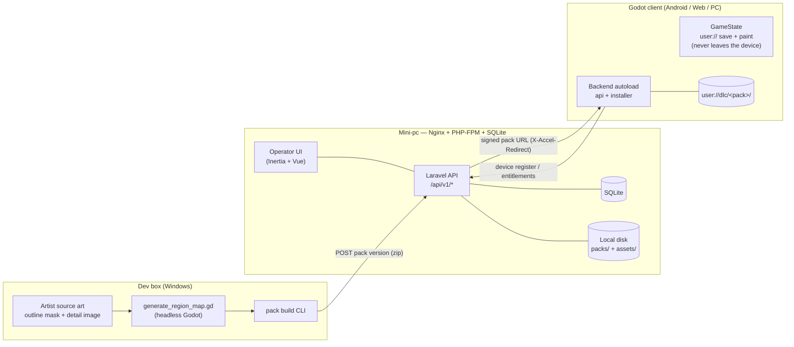
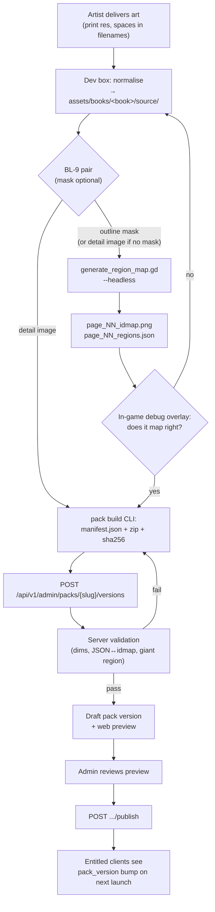

# DLC & Backend Server — Design

Backlog item **BL-8**. Originally pure design; as of 2026-08-09 **the server, its client
integration and the §10.3 web-authoring flow are built and live on the mini-pc** — §12
tracks phase status, and [SERVER_BUILD_PLAN.md](SERVER_BUILD_PLAN.md)'s Decisions table
records where the as-built app deviates from this document (SQLite not MySQL, Inertia + Vue
not Blade + Livewire, `server/` inside the game repo, and the **device-only identity**
decided 2026-08-09, which is what §4–§6 below describe). Phase 6 (payments) remains
design-only. Where a §-body below still speaks in the future tense, it is the original
design text — the deltas above and the per-entry as-built notes in
[BACKLOG_ARCHIVE.md](BACKLOG_ARCHIVE.md) are what actually shipped.

Companion documents: [DESIGN.md](DESIGN.md) (the game), [ANDROID.md](ANDROID.md) (exports),
[BACKLOG.md](BACKLOG.md) (open items) + [BACKLOG_ARCHIVE.md](BACKLOG_ARCHIVE.md)
(BL-9/BL-12 — the page display/mask split; BL-19/BL-24/BL-25/BL-26 — the delivery,
authoring and update rounds), and `server/CLAUDE.md` (as-built conventions — read it
before touching `server/`).

The server is a **Laravel** app on the Linux mini-pc, the same house stack as the
developer's other sites (as built: Nginx + PHP-FPM + SQLite; the game's web build lives
beside it at `http://192.168.0.164:91/`, the dashboard/API at `:92`). This document
assumes that stack and does not re-litigate it.

---

## 1. Goals & non-goals

### Goals

1. **No accounts. The device is the identity.** Nobody signs up, nobody signs in, nobody
   types an email — the install registers itself and is handed a token (§4). The game is
   fully playable whether that ever succeeds or not.
2. **Buy a pack once, own it on every device.** The store account already carries a
   household's purchases across devices; the server re-verifies the same receipt from a
   second device and grants that device its own entitlement (§9).
3. **DLC coloring-book packs.** Buy/claim a pack → it downloads → new books appear on the
   shelf, at runtime, in an exported build (where `res://` is read-only).
4. **An admin flow to publish books.** Upload the artist's source art, attach the mapping
   pipeline's output, preview it, publish it as a pack version.
5. **Offline-first, always.** The local save is the *only* save, and it never leaves the
   device. The network delivers catalogue and pack bytes; it is never a gate on a screen.
6. **Solo-developer sized.** One Laravel app, one database, local disk storage, Laravel's
   built-in queue. No microservices, no Kubernetes, no event bus.

### Non-goals

- **No player accounts, no sign-in, no account linking, no child profiles.** The one email
  address this system stores belongs to the *operator* who publishes packs (§4.1).
- **No cloud save-sync.** Progress, paint layers and sticker placements live in `user://`
  and stay there (§6). Nothing a child makes is ever uploaded.
- **No user-generated content, no sharing, no chat, no social graph, no leaderboards.** These
  are the features that turn a kids' app into a compliance project. Deliberately out of scope.
- **No third-party analytics or ad SDKs in the client.** This is the single biggest COPPA
  risk surface and the cheapest one to avoid: don't add it.
- **No server-side rendering of gameplay.** Painting stays entirely client-side.
- **No real-time multiplayer / websockets.** Every client call is request/response.
- **No CDN in v1.** One Nginx serving zips off local disk is enough for the expected scale.
- **The server is not the payment processor** on mobile — see §9.

---

## 2. Constraints that actually shape this design

These come from the existing code and are not negotiable without changing it:

| Constraint | Source | Consequence |
|---|---|---|
| `res://` is read-only in exports | Godot | DLC must install into `user://` |
| `BookDef.discover()` scans `res://resources/books/*/book.tres` only | `book_def.gd:79` | Discovery needs a second, `user://`-aware root |
| `PageDef` holds `res://` **paths**, and `PageView.load_page()` calls `load()` on them | `page_def.gd`, `page_view.gd:148` | Runtime PNGs need a texture-injecting overload; `load()` cannot open an unimported `user://` PNG |
| The save is keyed by `BookDef.resource_path` | `game_state.gd:336` `book_key()` | A `res://` path breaks the moment a book arrives in `user://dlc/`. Needs a stable `book_uid` — see §6.1 |
| The ID map must stay lossless or region IDs bleed | DESIGN.md §3.2 | Drives the pack format decision in §7.1 |
| `GameState` owns **all** of `user://` | `game_state.gd` header | The pack installer must go *through* `GameState`, not around it |
| Page status is already monotonic and sticky | `game_state.gd:462` `mark_page_status()` | Two book entries can be folded together without asking anybody, which is what the v1→v2 save migration needs — see §6.3 |
| A page is ~450–630 KB of shipped art (coyote) | `assets/books/coyote/` | A 12-page pack is ~6–8 MB. Small. No chunked-upload machinery needed |

---

## 3. System overview



`GameState` and `Backend` sit side by side rather than one above the other, and the missing
edge is the design: nothing the child paints is ever handed to the network layer.

Suggested deployment: a sibling Laravel app on the mini-pc, `coloringbook-api`, on its own
port next to the game's port-91 vhost, following whatever the house Nginx + PHP-FPM pattern
already is for the other sites.

---

## 4. Identity & authentication

### 4.1 The device is the identity

There is no player account anywhere in this system. An install of the game mints a
`device_uid` (a ULID, persisted in `user://`), registers it, and is handed a token. That is
the whole of who anybody is.

- **Nothing is collected about the player.** No email, no password, no name, no date of
  birth, no nickname, no avatar. The `device_uid` is a random string the client chose about
  itself and the server cannot resolve to a person.
- **`users` is an operator table.** The only rows in it belong to the person who signs in at
  `/admin/*` to publish packs; `is_admin` is the whole authorisation model, and rows are
  created by a seeder or a shell. There is no registration route in the application. That
  operator's email address is the only address stored anywhere.
- **The adult gate guards money, not identity.** The client still puts an arithmetic prompt
  in front of the one grown-up action left — *Restore purchases*, and later a purchase — for
  the reason it always did: it is a deterrent that keeps a five year old out of a screen
  meant for a parent, and it is the industry-normal pattern. It no longer guards a sign-in
  screen because there is not one.
- **COPPA-shaped posture in one line**: nothing a child makes ever leaves the device,
  nothing about a child is ever collected, we run no ads and no analytics, and the one
  identifier that exists is used solely to deliver content the device already owns — which
  is squarely the "support for internal operations" exemption. There is no consent flow to
  build because there is nothing to consent to, and no deletion button to build because
  uninstalling the app *is* the deletion.

### 4.2 Token auth for the Godot client

**Laravel Sanctum, personal access tokens (bearer), not SPA cookie mode.** Godot's
`HTTPRequest` is not a browser: there is no cookie jar, no CSRF token flow, and no
same-origin story worth having. Even for the Web export, cross-origin cookies would be a
fight for no benefit. One uniform bearer-token path across Android, Web and PC.

The token is minted **on the `Device` row itself** — `Device` is `Authenticatable` and
carries `HasApiTokens` — so `$request->user()` is a `Device` on every game route and a
device owns its entitlements directly, with no join through anything.

- The token is stored in `user://auth.json`. This is **not** secure storage on any of our
  platforms — assume it is readable. Mitigations, in order of importance:
  - **Abilities**: exactly `entitlements:read` and `packs:download`, and there is nothing
    else on the server for a game token to reach. It cannot publish a pack, cannot spend
    money, and cannot write a single byte of anybody's drawing, because no such route exists.
  - **Expiry**: 90 days sliding; the expiry moves forward on any successful call. An expired
    token puts the game into offline mode, silently — never a modal in a kid's face.
  - **Scoped to one install.** The token's *name* is the `device_uid`, so deleting the tokens
    of that name signs out exactly one install.
- **There is no refresh route, and no sign-out route.** A `401` is recovered by calling
  `/device/register` again with the same uid: find-or-create is what makes re-auth
  idempotent — the row survives, its entitlements survive, only the token string rotates.
- Rate-limit registration hard (`throttle:6,1`, stacked on the API-wide `throttle:60,1`):
  it is the one route that mints a credential out of a client-chosen string.

### 4.3 Registration, and why it is not a hole

```
POST /api/v1/device/register   {device_uid, device_name, platform}
    → {token, abilities, expires_at, device: {ulid}}
```

**This contract is pinned.** The shipped game codes against exactly these field names, there
is no second identity to fall back on, and old builds live on players' devices forever.

- **Find-or-create, unauthenticated, by `device_uid` alone.** `devices.device_uid` is
  globally unique; there is no account for it to be scoped inside.
- **It runs on startup, silently, and nothing waits for it.** The title screen is already up.
  If it succeeds the catalogue can say what this device owns and a paid pack will download;
  if it fails the app is simply offline for the session — free packs, installed packs and
  every drawing on disk behave exactly as before, and the next launch tries again. The player
  is never told either way.
- **Knowing a `device_uid` is knowing a password.** That is the honest framing of the
  no-auth route: an attacker holding somebody's uid gets that device's entitlements, exactly
  as a stolen password would have got them an account's. The uid is a 128-bit ULID that the
  client never displays, never puts in a URL and never sends anywhere but this route's body.
- **The store account is the cross-device identity for purchases.** Play Billing and StoreKit
  return the same purchase tokens on every device signed into the same store account, and
  each device re-verifies them (§9) to earn its own entitlement rows. The server never needs
  to own an identity to stop somebody paying twice — which is the whole reason accounts are
  not needed here.

**The client half, as built.** `AuthStore` owns `user://auth.json` — schema **v2**,
`{device_uid, device_name, token, abilities, expires_at}` — and a v1 file (which held an
account) is migrated by keeping its `device_uid` and discarding everything else.
`Backend.sign_in_device()` is the startup call, fire-and-forget; `Backend._authed()` replays
a request **exactly once** after re-registering on a `401`, so a dead token costs one extra
round trip and never a user-visible failure. `Backend`'s two carve-outs from `GameState`'s
monopoly on `user://` are `auth.json` and `dlc/`, and neither is anything the game saves.

---

## 5. Data model

MySQL. Laravel conventions (`id` bigint auto-increment, timestamps). Where a value is public
or crosses the client boundary, add a `ulid`/`slug` column and expose that, never the numeric
id. *(As built: SQLite — see the build plan's Decisions table.)*

### Identities

```
users                 id, ulid, email (unique), password, is_admin, timestamps
                      OPERATORS ONLY — the person who publishes packs. No player
                      has a row here and there is no route that creates one.
devices               id, ulid, device_uid (globally unique), device_name,
                      platform, last_seen_at, timestamps
                      One install of the game, and the whole of a player's identity.
personal_access_tokens   (Sanctum's own table; a game token is tokenable=Device,
                          named after the device_uid — see §4.2)
```

`devices` has no `user_id`: there is nothing for it to point at. `Device` is the
`Authenticatable` the game's tokens are minted on, which is why `entitlements` below can
name it directly.

### Catalog & content

```
packs                 id, ulid, slug (unique), kind ('book'|'sticker_set'),
                      title, blurb, cover_path,
                      status ('draft'|'published'|'retired'), is_free,
                      sku_google, sku_apple, sku_stripe, sort_order, timestamps
pack_versions         id, pack_id →packs, version (int, monotonic per pack),
                      manifest json, archive_path, archive_bytes, archive_sha256,
                      min_client_version, published_at, timestamps
books                 id, ulid, pack_id →packs, book_uid (unique, stable forever),
                      title, cover_asset_id, sort_order, timestamps
pages                 id, book_id →books, page_index, title,
                      display_asset_id  →assets   (the visible art)
                      mask_asset_id     →assets   (nullable — optional outline mask; source-only, BL-9)
                      idmap_asset_id    →assets
                      regions_asset_id  →assets
                      image_w, image_h, region_count, timestamps
sticker_sets          id, ulid, pack_id →packs, set_uid (unique, stable forever),
                      title, cover_asset_id →assets, sort_order, timestamps
stickers              id, sticker_set_id →sticker_sets, sticker_index,
                      sticker_id, title, image_asset_id →assets,
                      image_w, image_h,
                      anim json (nullable — sprite sheet, BL-41), timestamps
                      UNIQUE(sticker_set_id, sticker_index)
                      UNIQUE(sticker_set_id, sticker_id)
assets                id, ulid, kind ('display'|'mask'|'idmap'|'regions'|'cover'|'sticker'),
                      storage_path, bytes, sha256, mime, width, height, timestamps
```

`packs.kind` (BL-37) says which of the two payload tables a release rebuilds: a `book`
pack's `books`/`pages`, or a `sticker_set` pack's `sticker_sets`/`stickers`. Both are
projections of the newest published release and are dropped and recreated on every
publish, so neither holds draft state (see §10.3's `authored_*` tables and their BL-37
twins, `authored_sticker_sets` / `authored_stickers`).

`set_uid` is the sticker half of `book_uid`: authored once, globally unique, stable
forever, and named by every sticker placement in a child's save (BL-36). `sticker_id` is
unique **within** its set — a placement names the pair — and there is deliberately no ID
map, regions JSON or `region_count` here: a sticker has no regions, so §10.1's mapping
pipeline does not apply to it and its publish gate is image validation only.

`book_uid` is the load-bearing identifier: authored once (e.g. `coyote-2026`), never reused,
never derived from a filename or a `res://` path. Built-in books get one too (§6.1).

### Entitlements

```
entitlements          id, device_id →devices, pack_id →packs,
                      source ('purchase'|'promo'|'free'|'gift'|'admin'),
                      platform ('google'|'apple'|'stripe'|null),
                      platform_txn_id nullable,
                      granted_at, revoked_at nullable, timestamps
                      UNIQUE(device_id, pack_id)
                      UNIQUE(device_id, platform, platform_txn_id)
```

**The owner is a device, and only a device.** One row per `(device, pack)` — owning a pack
is not a quantity. `revoked_at` (a refund, or an admin take-back) is deliberately *not* a
delete: it hides the books from the shelf while the pixels a child already painted stay on
the tablet (§7.3), and a revoked free pack stays revoked because the auto-grant never
resurrects it.

**Receipt uniqueness is per device, on purpose.** `UNIQUE(device_id, platform,
platform_txn_id)` rather than a global `UNIQUE(platform, platform_txn_id)`: Play Billing and
StoreKit hand the *same* purchase token to every device signed into the same store account,
and each of them legitimately earns its own row. That is the entire "restore purchases"
mechanism (§9), and Google Play requires non-consumables to be restorable. Within one device
it is still once-only, so a replayed receipt cannot mint a second row. SQL treats NULLs as
distinct, so free/promo rows with no platform are unaffected either way.

### Saves

There are none on the server. A child's progress, paint layers and sticker placements live
in `user://` on the device that made them and are never uploaded — see §6.

### Storage layout on disk

```
storage/app/private/
  packs/<pack_slug>/v<version>/pack.zip        # the shipped bundle
  packs/<pack_slug>/v<version>/files/...       # unpacked, for per-file delta downloads
  assets/<sha256[0:2]>/<sha256>                # content-addressed originals (incl. masks)
```

Everything on this disk is **content the operator published**. No byte of it came from a
player, which is what makes the backup story (**Q2**) small: a lost disk costs a re-publish,
never somebody's drawing.

Content-addressing the assets means re-uploading identical art is free and a checksum
mismatch is detectable without a database round trip.

---

## 6. Saves — local, and only local

**The `user://` save is the whole persistence story.** Nothing in this section describes a
network call, because there is not one: no progress endpoint, no paint blob, no merge, no
conflict, no erase clock. `GameState` keeps its monopoly on `user://` and `Backend` never
reads it. A drawing exists on the device it was drawn on, and moving a child's colouring
between two tablets is not a feature this product has.

What survives from the original cloud design, and why it is still here: the **save's key**
(§6.1), which stopped being a `res://` path so that a book delivered in a pack could be
saved against at all, and the **status ordering** (§6.3), which the v1→v2 migration folds two
book entries together with.

### 6.1 The save's key: `book_uid`

Today (`game_state.gd`, `save_v1.json`):

```json
{ "version": 1, "mode": "child",
  "books": { "res://resources/books/coyote/book.tres":
             { "slug": "coyote_1a2b3c4d", "current_page_index": 1,
               "pages": [ { "status": "complete",    "locked": true },
                          { "status": "in_progress", "locked": false } ] } } }
```

(A page entry was a bare status string until BL-10 added the coloring lock; the
reader still accepts that form, so v1 files from before it load unchanged.)

Paint lives beside it at `user://paint/<book_slug>/page_NN.png`, and since BL-38 an animated
finish adds `page_NN_fx.png` next to it.

The problem is **the key**. `res://resources/books/coyote/book.tres` is a build-time path: it
breaks the moment the book arrives in `user://dlc/…` instead, and since BL-25 a release build
ships no `res://` books at all, so every book on a player's shelf is one of those. So:

> **Decision — save schema v2.** Introduce `BookDef.book_uid` (an authored `@export String`),
> key the save's `books` object by `book_uid`, and migrate v1 files with a lookup table of the
> two known `res://` paths → their new uids. `book_slug()` (the paint directory name) keeps
> its existing derivation but hashes the **uid** instead of the resource path, and v1 paint
> directories get renamed once during migration. This is a client-side change with no server
> dependency and belongs in **Phase 0**.

`book_uid` is authored once, globally unique and never reused — the same promise §7.2 makes
about it in a pack manifest, and the reason a book keeps its progress across a pack update,
a re-install or a move from a built-in fixture to a downloaded pack.

The `mode` field stays local — and since BL-20 (2026-08-07) it is vestigial everywhere:
the game has one palette, nothing writes or branches on `mode`, and readers merely
tolerate the key in old saves.

### 6.2 What leaves the device

Nothing the player creates. This is the whole table:

| Data | Where it lives | Leaves the device? |
|---|---|---|
| Progress JSON (per book) | `user://save_v2.json` | **No.** |
| Paint layer PNG (per page) | `user://paint/<book_slug>/page_NN.png` (+ `_fx.png`, BL-38) | **No.** |
| Sticker placements (per page) | in the same save, beside `status`/`locked` (BL-36/BL-42) | **No.** |
| Settings | local | **No.** |

The save points do not change and never did: page complete, leaving the book, app quit
(DESIGN.md §3.2, M6). What changed is that they are now the *end* of the write path rather
than the start of one — nothing hooks `GameState.save_written` to push anything, and no
part of the network layer ever calls `get_paint_image()`.

Two consequences worth stating plainly, because they are the price of this design and it was
paid deliberately:

- **A drawing is only ever on one device**, and a second tablet starts with an empty shelf of
  the same books. Colouring is not portable, and a family with two tablets has two shelves.
- **Uninstalling the app deletes the artwork**, because nothing anywhere else has a copy.
  Platform-level backup is the only mitigation and it is off (`user_data_backup/allow=false`
  — see [ANDROID.md](ANDROID.md)).

What is bought is portable; what is drawn is not. That asymmetry is §9's whole subject.

### 6.3 Status ordering — the one merge rule that survives

Page status is monotonic and sticky: `mark_page_status()` refuses to downgrade a `complete`
page, and coverage only climbs. The ordering that falls out of it,

```
untouched < in_progress < complete
```

is still written down here because one piece of live code needs it: the **v1→v2 save
migration**, where two `res://`-keyed book entries can migrate onto the same `book_uid` and
have to be folded into one. The fold is the obvious one — the better status wins per page, a
lock anywhere wins, the furthest cursor wins, and nothing is ever downgraded —
`GameState._merge_book_entries()`.

It is commutative and idempotent, which is worth keeping true even now that only a migration
uses it: a save that is loaded twice must not come out different the second time.

Everything else that used to live in this section — optimistic revisions, last-write-wins on
paint, the 30-day retention net, the erase clocks of BL-18 — existed to reconcile two devices
that had both written. There is one writer now, so there is nothing to reconcile.
**"Erase all progress" and the page's "Start over" are plain local deletes**, and the
absence they leave is permanent because nothing will ever pull it back.

---

## 7. DLC packs

### 7.1 Pack format — a data bundle, not a Godot `.pck`

This is the pivotal decision, so the rejected option is worth writing down.

**Rejected: ship each pack as a Godot `.pck` and `ProjectSettings.load_resource_pack()` it.**
Attractive because it mounts into `res://` and `BookDef.discover()` would work untouched. But:

- A `.pck` must be built by a Godot **editor** with matching **export templates**. PHP cannot
  produce one; the server would have to shell out to a Godot binary, and every engine upgrade
  puts already-sold packs at risk.
- VRAM texture compression is per-platform, so it means separate Android / Web / desktop
  builds of every pack.
- A `.pck` can contain **scripts**. A content bundle that can execute code is a category of
  problem we don't need.
- Worst of all, it drags the `.import` lossless-flag hazard (DESIGN.md §3.2:
  `compress/mode=0`, `mipmaps/generate=false`, `detect_3d/compress_to=0`) into an artifact
  built by a pipeline nobody is watching. A silently VRAM-compressed ID map corrupts region
  IDs — the exact bug both skills warn about.

> **Decision — packs are plain data zips**, unpacked into `user://dlc/<pack_slug>/`, and their
> textures are loaded at runtime with `Image.load_from_file()` → `ImageTexture.create_from_image()`.

The upside is not just neutrality, it is a genuine correctness win: **a runtime
`ImageTexture` never goes through the Godot importer, so the ID map cannot be VRAM-compressed
behind our back.** The lossless invariant becomes structural rather than a `.import` file we
have to guard in diffs. (`TEXTURE_FILTER_NEAREST` is still set at the sampler, exactly as
today — that was never an import flag.)

The cost is honest and bounded: three small client changes (§8.1), and a PNG decode on load.
A 2048² decode is tens of milliseconds; do it on a `WorkerThreadPool` task behind the
existing page-flip / loading beat, not on the main thread during a stroke.

### 7.2 Pack layout & manifest

```
pack.zip
  manifest.json
  cover.png
  books/coyote-2026/book.json
  books/coyote-2026/page_01.png            # the DISPLAY image (BL-9)
  books/coyote-2026/page_01_mask.png       # only when the page has a mask (BL-12)
  books/coyote-2026/page_01_idmap.png
  books/coyote-2026/page_01_regions.json
  books/coyote-2026/page_02.png
  ...
```

The mask a pack ships is the **display-resolution artifact**, not the artist's original
(BL-12, 2026-08-06, which reversed BL-9's "never shipped" rule): since BL-12 the mask is
rendered at runtime as a layer under the display image, so when a page has one, the
pipeline's resampled `page_NN_mask.png` goes in the pack. The server still keeps the
print-size original (`assets.kind = 'mask'`) so a pack can be regenerated. The mask remains
**optional per page** (clarified 2026-08-06): every page has a detail (display) image, and
when no mask is supplied the display image itself is the mapping-pipeline source and no
mask file appears in the pack.

**A pack carries ONE KIND of content** (BL-37, 2026-08-07). Until then every pack was
books and the manifest said so by having a `books[]` array; sticker sets are catalog
content delivered by the exact same machinery, so the one thing that had to become
explicit is which payload the manifest is carrying:

```
pack.zip                                   manifest kind: "sticker_set"
  manifest.json
  stickers/starter-stickers-2026/sticker_set.json
  stickers/starter-stickers-2026/star.png
  stickers/starter-stickers-2026/heart.png
  ...
```

- `kind` is `book` or `sticker_set`. **Absent means `book`** — every manifest written
  before BL-37 has no such key and every one of them is books — and `packs.kind` defaults
  the same way, so nothing about an existing pack, an installed client or a delta moved.
- Sticker files are named after the sticker's **stable `sticker_id`**, never its index: an
  index moves when a set is reordered, and a delta update would then re-download every
  file after the one that moved.
- `sticker_set.json` per set is the same shape as one entry of the manifest's
  `sticker_sets[]` array — exactly what `book.json` is for a book — so the installed tree
  is self-describing and `StickerSetDef.discover()` never opens the manifest.
- `set_uid` is load-bearing the way `book_uid` is (§6.1): a saved sticker placement in a
  child's save names `(set_uid, sticker_id)`, so both are authored once and never reused.
  `sticker_id` is unique **within its set**, not globally — two sets may both offer a
  `star`.
- **Delta updates (§7.4, BL-26) are untouched.** They diff the manifest's per-file sha256
  map and have never cared what the files are; a sticker pack updates through the same
  code path, verbatim.
- **A sticker may be animated** (BL-41, 2026-08-08). Its image is then a sprite-sheet PNG
  and its entry carries one extra object:

  ```json
  { "sticker_id": "sparkle", "image": "stickers/…/sparkle.png",
    "anim": { "hframes": 4, "vframes": 2, "frames": 7, "fps": 12 } }
  ```

  `hframes`/`vframes` are the grid, columns then rows; `frames` is how many cells are
  actually drawn, read **row-major from the top left**, and may be fewer than
  `hframes × vframes` so a 7-frame animation need not be padded to a rectangle nobody
  drew; `fps` is 1–30. A **still sticker has no `anim` key at all** — not `null`, not an
  empty object — which is what every sticker published before BL-41 looks like and the
  whole of the back-compatibility story. The server validates the sheet against the grid
  (it must divide evenly, and `sticker_min_px`/`sticker_max_px` are measured on **one
  frame**, with the sheet itself bounded by `sticker_sheet_max_px`).

**A book's cover may be authored** (BL-40, 2026-08-08). `books[].cover` and the pack-level
`cover` are one path, and it is either `books/<book_uid>/cover.png` — art the artist drew to
be a cover, shipped in the pack like any other file — or, when there is none,
`books/<book_uid>/page_01.png`, which is exactly what every book published before BL-40
shipped. The game uses the cover for the bookshelf grid and the book open/close animation
and falls back to the first page's detail image when a pack has no cover at all, so the
field stays optional at every layer.

`manifest.json`:

```json
{
  "manifest_version": 1,
  "kind": "book",
  "pack_slug": "forest-friends",
  "pack_version": 3,
  "title": "Forest Friends",
  "cover": "cover.png",
  "min_client_version": "0.7.0",
  "books": [
    {
      "book_uid": "coyote-2026",
      "title": "Coyote",
      "cover": "books/coyote-2026/page_01.png",
      "pages": [
        {
          "page_index": 0,
          "title": "Coyote at dusk",
          "display": "books/coyote-2026/page_01.png",
          "idmap":   "books/coyote-2026/page_01_idmap.png",
          "regions": "books/coyote-2026/page_01_regions.json",
          "image_size": [2048, 2048],
          "region_count": 15
        }
      ]
    }
  ],
  "files": { "books/coyote-2026/page_01.png": { "bytes": 563210, "sha256": "…" } }
}
```

`book.json` per book is the same shape as a manifest's `books[]` entry — so the installed
tree is self-describing and a `user://dlc` folder can be inspected (or hand-seeded during
development) without the manifest.

The per-file `files` map exists for one reason: **delta updates**. A pack bumping from v3 to
v4 to fix one page downloads that one page, not 8 MB.

### 7.3 Versioning & updates

- `pack_version` is a **monotonic integer per pack**, not semver. Content has no API surface
  to be compatible with; a plain counter is enough and is unambiguous when comparing.
- Published pack versions are **immutable**. Fixing a typo means publishing v4.
- The client records the installed version per pack and checks for updates on launch (folded
  into the entitlements call, no extra round trip).
- Updates are applied on next book open, never while a page is loaded. Install to
  `user://dlc/<slug>.incoming/`, verify every `sha256`, then atomic-swap the directory —
  a half-downloaded pack must never be discoverable.
- `min_client_version` lets a pack that needs a new feature (say, a future multi-layer page)
  stay invisible to old builds instead of crashing them. The client filters on it before
  offering the download.
- **Never delete a pack's files on entitlement loss.** If a refund revokes an entitlement,
  hide the books from the shelf; the pixels a child already painted stay on disk.

### 7.4 Delivery

- `GET /api/v1/packs/{slug}/download` (device token + `packs:download` + entitlement)
  responds `302` to a **short-lived signed URL** (`URL::temporarySignedRoute`, 10 min).
- **Free packs are public.** When the pack `is_free` and is in a downloadable status,
  `manifest`, `download` and `files/{path}` skip the token and entitlement gate entirely — an
  install whose registration has never succeeded can still download every free book. The
  302-to-signed-URL mechanics below are untouched (the signature was always what moves
  bytes), the per-IP throttle stays, and the free-claim auto-grant still fires when a token
  *is* present, so `owned` and `GET /entitlements` keep their meaning. Whether a route needs
  a token therefore depends on the **pack**, which is why the check lives in
  `PackDownloadController::authorised()` rather than in route middleware.
- The signed route hands off to Nginx with **`X-Accel-Redirect`** into a private `internal;`
  location. PHP-FPM authorises; Nginx pushes the bytes. This is the standard house pattern
  and keeps a 8 MB download off a PHP worker.
- Per-file delta downloads use the same mechanism against `.../files/<path>`.
- Godot side: `HTTPRequest.download_file` straight to `user://dlc/<slug>.incoming/…`, so a
  large pack is never held in RAM. Show real progress from `HTTPRequest.get_downloaded_bytes()`
  against the manifest's total.
- **Web export caveat**: `user://` is IndexedDB (with `OS.get_data_dir()` persistence and a
  browser storage quota), and the download must be same-origin or CORS-allowed. Since the
  game and the API would both live on the mini-pc, put the API behind a path on the game's
  vhost (`/api/…`) rather than a second port, and the CORS problem disappears. Quota is a real
  limit for many packs — see **Q7**.

*As built, client side (BL-19 + BL-26, 2026-08-07). `PackInstaller` chooses per install:*

- ***First install = the archive.*** *Nothing to diff against, and one zip beats N requests.*
- ***Update = a per-file delta.*** *When a version is already installed and a newer one is
  asked for, the new manifest's `files` map is diffed against **the bytes on disk** (hashed,
  not against the old manifest — a file a crash truncated still has a good old entry). Files
  whose sha256 already match are copied into `.incoming`; the rest are fetched from
  `.../files/<path>`; anything gone from the new manifest is simply never carried over.
  Progress counts against the delta's size, so a 567-byte fix reads as 567 bytes.*
- ***The delta is an optimisation and can never be a failure mode.*** *A bad diff, a failed
  per-file fetch, or a delta-built tree that fails verification all restart on the archive
  path silently; the caller only ever learns which route won, via the result's `mode`.*
- ***The 302 is read on native and followed in a browser*** *(both the archive and the files
  route). Godot's web HTTP client is `fetch()` with the default `redirect: "follow"`, so a
  browser never exposes `Location` to the caller and `max_redirects = 0` cannot work there;
  the web build issues the authorised request and lets the browser follow. Measured in
  Chrome: on a **same-origin** redirect fetch forwards `Authorization` (to an origin the
  token already goes to on every call, which is what the same-origin deployment above
  guarantees), and on a **cross-origin** redirect it strips it.*

---

## 8. Godot client integration

### 8.1 Required client changes (all doable before any server exists)

1. **`BookDef.book_uid`** — an authored `@export String`, plus `book_key()` switching to it
   and a v1→v2 save migration (§6.1).
2. **`BookDef.discover()` gains a second root.** Keep the `res://` scan exactly as it is
   (build-in books), then scan `user://dlc/*/books/*/book.json` and build `BookDef`/`PageDef`
   instances in memory from the JSON. Same shelf, same ordering rules, sourced from two
   places. Books from a pack the user is no longer entitled to are filtered out by the caller,
   not by `discover()`. *(Since BL-25, 2026-08-07: release exports exclude the `res://` books,
   so in a shipped build the first root is empty by construction and every book on the shelf
   came from the server. The `res://` scan survives for the editor and dev smokes.)*
3. **`PageDef` gains an optional texture source.** The display/mask split itself is **done**
   (BL-9, 2026-08-06, amended by BL-12): `PageDef` carries `display_image_path` (visible,
   required) plus an optional `mask_image_path` — since BL-12 that path names the shipped
   display-resolution mask artifact, which is rendered as a layer under the display image —
   and a page with no mask uses its display image as the mapping source. What is left for DLC
   is that these may be `user://` files that must be loaded as `Image` rather than
   `load()`ed as resources. Concretely: `PageDef` grows `is_runtime` + resolved absolute
   paths, and `PageView` grows `load_page_textures(base: Texture2D, idmap: Texture2D,
   regions: Dictionary, mask: Texture2D = null)` as the primitive, with today's
   `load_page(paths…)` becoming a thin wrapper over it. `_id_image` handling, the shader,
   and the whole stroke lifecycle are untouched.
4. **A `Backend` layer.** DESIGN.md §3.4 and the godot-practices skill both say "one
   autoload", and this proposes a second. The justification: a device token, a cached
   entitlement list and an in-flight download genuinely outlive every screen — the shelf is
   freed while a download continues — and threading them through `main.gd` would put
   networking in the flow orchestrator. The mitigation: `Backend` is a **thin facade** over
   plain `RefCounted` classes (`api_client.gd`, `auth_store.gd`, `entitlements_store.gd`,
   `pack_installer.gd`) that are unit-testable without the tree, it owns **no game state**
   (`GameState` keeps its monopoly on `user://` bar two carve-outs, `auth.json` and `dlc/`),
   and with no server reachable every method is a no-op rather than an error. Flagged as
   **Q3** — worth an explicit yes.

### 8.2 Offline-first behaviour

Non-negotiable rules:

- **No screen ever awaits a request.** Title, shelf, and colouring screens render from local
  state and are patched when a response lands.
- **The local save is the only save.** `GameState` is the sole writer of a child's work and
  `Backend` never reads it. Nothing in the network layer uploads anything, ever.
- **A dead token is answered, not reported.** There is no refresh route: a `401` makes
  `Backend` re-register under the same `device_uid` and replay the request exactly once
  (§4.2). Twice would be a loop; nothing user-facing changes either way.
- **Books are never yanked away offline.** Hiding a book off the shelf takes a *positive*
  revocation from a successful `GET /entitlements` — a failed call leaves the last known good
  cache in place, so a flat network never empties a shelf.
- **Failures are silent to the child.** Network errors go to a debug log and a warning.
  Never a modal, never a kid-facing string.
- **Every request has a timeout** (`HTTPRequest.timeout`, 10 s for JSON, 120 s for a pack) and
  exponential backoff with jitter, capped at ~5 minutes. Give up quietly after that until the
  next app launch.
- **Downloads are user-initiated.** A pack never starts downloading on its own — a kid on a
  parent's phone plan does not silently pull 8 MB. Tapping a locked book on the shelf asks.

### 8.3 The client's whole conversation with the server

Three exchanges, and that is all of them.

```mermaid
sequenceDiagram
    participant S as Store (Play / StoreKit)
    participant B as Backend
    participant A as Laravel API

    Note over B,A: App launch — silent, nothing waits on it
    B->>A: POST /api/v1/device/register {device_uid, device_name, platform}
    A-->>B: 200 {token, abilities, expires_at, device}
    B->>A: GET /api/v1/entitlements?client_version=…
    A-->>B: owned packs + latest_version (this IS the update check, §7.3)

    Note over B,A: The grown-up tapped Get, or a pack version moved
    B->>A: GET /packs/{slug}/manifest?version=
    B->>A: GET /packs/{slug}/download   (or …/files/&lt;path&gt; per file)
    A-->>B: 302 → signed URL → bytes (X-Accel-Redirect)
    B->>B: verify every sha256 → atomic swap into user://dlc/&lt;slug&gt;/

    Note over B,A: Restore purchases (behind the AdultGate)
    S-->>B: the store's receipts for this store account
    loop each receipt
        B->>A: POST /api/v1/entitlements/verify {platform, purchase_token, sku}
        A-->>B: 200 — granted to THIS device
    end

    Note over B,A: 401 anywhere above
    B->>A: POST /device/register (same uid) → replay the request once
```

Any of the three failing leaves the game exactly as playable as it was; none of them carries
a single byte a child drew.

---

## 9. Entitlements & payment reality

Worth stating plainly because it constrains the API more than anything else:

- **On Android, digital content sold inside the app must go through Google Play Billing.**
  So the server is the **entitlement authority**, not the payment processor: the client
  completes a Play purchase, sends the purchase token to
  `POST /api/v1/entitlements/verify`, and the server validates it against the Play Developer
  API and writes an `entitlements` row. Same shape for Apple/StoreKit if iOS happens.
- **On web/desktop**, Stripe Checkout is the path of least resistance, with the webhook
  writing the same `entitlements` row against the device that started the checkout. Still
  Phase 6, and still open (**Q6**).
- **The client never decides what it owns.** It caches the entitlement list (with a "last
  known good" fallback for offline play), but every paid download is authorised server-side.
- **Free packs are the honest first milestone.** They exercise the entire catalogue,
  entitlement, download and install path with zero payment integration — see the rollout.

### Restore purchases is the load-bearing path

With no accounts, **re-verifying a store receipt is the only way a purchase reaches a second
device**, and Google Play *requires* non-consumables to be restorable, so it is not optional
either.

- `POST /entitlements/verify` `{platform, purchase_token, sku}` takes a device token and
  writes the entitlement to the device that token was minted on. Validation goes through a
  `StoreReceiptVerifier` contract (config seam `coloringbook.stores.*`), which ships **all
  null** — an unconfigured platform answers `STORE_UNAVAILABLE` (503, retryable) rather than
  silently accepting receipts it cannot check. Phase 6 is therefore "bind a real verifier and
  add the billing plugin", not a schema change.
- The new-device flow is: install → register (§4.3) → ask the store for this store account's
  receipts → re-verify each one → the packs download. **Bought once, owned everywhere, nobody
  typed an email.**
- `entitlements` is keyed per device for exactly this reason (§5): the same purchase token
  legitimately grants on every device that presents it.
- Client side, this is one button. `Backend.restore_purchases()` posts each receipt that
  `Backend.get_store_receipts()` returned — the billing-plugin seam, which answers an empty
  array on every platform that has no store — and the settings overlay's **Purchases →
  Restore** row sits behind the `AdultGate`. The gate guards money now; it used to guard a
  sign-in screen (§4.1).
- **A paid pack nobody owns reads "In the store"** in the shop, rather than offering a
  download it would be refused. The row keys off the server's own two flags (`is_free`,
  `owned`) and never off "is anybody signed in", because nobody ever is. Until Phase 6 binds
  a store, that state is honest and terminal: the way to own it is to buy it where it is
  sold.

---

## 10. Book & page upload / admin

### 10.1 Where the mapping pipeline runs

> **Decision — the mapping pipeline stays a local dev tool. The server accepts and validates
> its output; it does not run it.**
>
> *Amended 2026-08-07 (BL-24): still true for dev-box packs, but web-authored books (§10.3)
> run the same pipeline server-side via the escape hatch this section reserved.*

Reasoning, and this is not a performance argument:

1. **The pipeline is not one-shot, it is a tuning loop.** Per the mapping-pipeline skill, real
   art needs per-page `--line-alpha-min` / `--dilate` / `--min-area` / `--rdp` tuning, and the
   verdict on whether a mapping is *correct* comes from **looking at the ID map**. Wrapping
   that in a web UI would mean rebuilding a terminal-plus-image-viewer loop, worse, over HTTP.
2. **The interesting failures need an artist, not a retry.** The giant-region failure means a
   line has a gap and the drawing must be fixed. A server job cannot fix that; it can only
   report it, which the dev-box run already does more usefully.
3. **Operationally it is the expensive choice.** Headless Godot on the mini-pc means a
   ~100 MB engine binary, a queue worker with real memory limits for 2048² images, and a
   second place where an engine upgrade can break content — for a step that runs a handful of
   times per book, ever.
4. **The dev box already has the art.** The artist's originals live at
   `assets/books/<book>/source/` behind a `.gdignore`. The pipeline runs where the source
   lives.

What the **server does** instead — cheap, pure-PHP, and it catches the failures that actually
happen (someone uploading mismatched artifacts):

- **Validation on upload**: display and ID map have identical dimensions; the regions JSON is
  schema v1 and its `image_size` matches; every `id` in the JSON appears as a distinct colour
  in the ID map and vice-versa (count them — a mismatch means the JSON and the PNG came from
  different runs); `#000000` is present; no region below the minimum area; `region_count > 0`
  and not "one giant region" (largest region < ~90 % of paintable pixels).
- **Preview**: render a web preview by compositing the ID map's regions as random tints under
  the display art — the same debug overlay the game has, in the browser, for the reviewer.
- **Store the mask** (`assets.kind='mask'`) so a page can be regenerated later against an
  improved pipeline without chasing the artist.

A deliberate escape hatch for later, if it is ever wanted: a queue worker shelling out to
headless Godot for a *first-pass* mapping, with the dev-box run remaining canonical and
overridable. Explicitly **not** Phase 1–6 work. *(Taken up 2026-08-07 — §10.3 promotes
exactly this for web-authored books.)*

### 10.2 Admin flow



The admin UI is **Blade + Livewire in the same Laravel app**, gated by `users.is_admin`.
It is a single-operator tool: no roles, no workflow states beyond
`draft → published → retired`, no approval chain.

`pack build` is a small script on the dev box (GDScript run headless, or Python — whichever is
less friction) that walks `resources/books/<book>/`, resolves each `PageDef` to its three
artifacts, writes `manifest.json` + `book.json`, zips, and POSTs with an admin token. It is
the same tool a developer would otherwise write by hand three times.

### 10.3 Web authoring — books, pages, publish (2026-08-07, BL-24)

The admin site becomes an **authoring surface**, not just an upload door. The §10.1
decision is amended, not reversed: the dev-box run remains available (and canonical for
hand-tuned pages), but a book can now be built end-to-end in the browser.

- **Books.** The admin creates and deletes coloring books in the browser. A web-authored
  book gets its own **one-book pack** (pack slug = the book's slug, `is_free` chosen at
  creation): packs stay the delivery/entitlement unit and the game client changes not at
  all, while the operator thinks in books. Deleting a never-published book removes it
  outright; deleting a published one **retires** its pack (§7.3 — never delete files a
  household owns).
- **Pages.** Per book: add, remove, reorder, retitle pages; upload or replace the
  **detail (display) image** and the **optional masking image** per page. BL-9/BL-12
  semantics hold exactly: mask present → the mask is the mapping source and its
  display-resolution resample ships as `page_NN_mask.png`; mask absent → the display
  image is the mapping source and no mask file appears in the pack. Uploads are
  content-addressed `assets` rows (`display`/`mask` kinds), the same store §10.2 uses.
- **Mapping runs server-side, per page, as a queued job** whenever a page's detail or
  mask changes. The job shells out to **headless Godot running
  `tools/generate_region_map.gd`** — one implementation, never a PHP port — writes the
  idmap/regions (and resampled-mask) artifacts back as `assets`, then runs the existing
  §10.1 `PackValidation` checks and stores the verdict on the page. The page editor
  shows the §10.1 region-overlay preview and the failure report (a giant region still
  means "a line has a gap — fix the art"; the editor says so instead of hiding it).
  Default tuning knobs with optional per-page overrides stored on the page row cover
  the §10.1 tuning loop at web quality; a page needing real hand-tuning can still be
  mapped on the dev box and its artifacts uploaded to override the job's output.
- **Publish** is one button on the book. It refuses while any page is unmapped or
  failing validation; otherwise it builds the §7.2 pack directory from the book's
  current pages (manifest.json, book.json, per-page display/mask/idmap/regions) and
  hands it to `PublishPackDirectory` + `PublishPackVersion` — the single existing
  publish path. The result is an immutable new `pack_versions` row (§7.3); the game
  sees the version bump through the existing entitlement/update check and downloads
  the delta. Edits after publishing accumulate as draft state until the next press.
- **Cover** (BL-40, 2026-08-08). A book may carry an artist-supplied cover image,
  uploaded and replaced on the book screen beside its pages. It is **optional**: with one,
  the publisher ships `books/<book_uid>/cover.png` and names it as both the pack cover and
  the book cover; without one, both stay page one's display art, which is what every book
  published before BL-40 shipped. The game uses it for the bookshelf grid and the book
  open/close animation and falls back to the first page when a pack has none, so the
  optionality holds at every layer and no existing pack changed.

### 10.4 Web authoring — sticker sets (2026-08-07, BL-37)

The same authoring surface, one content kind over — and **strictly simpler**, which is the
whole point of the entry:

- **Sets.** The operator creates and deletes sticker sets in the browser. A set gets its
  own **one-set pack** (`packs.slug` = the set's uid, `packs.kind = 'sticker_set'`,
  `is_free` chosen at creation), for the reason a web-authored book gets a one-book pack:
  packs stay the delivery and entitlement unit and the game client's download path did not
  move an inch. Deleting a never-published set removes it outright; deleting a published
  one **retires** its pack (§7.3) — which matters more here than for books, because the
  stickers a child has already stuck on a page name that set and would otherwise vanish
  from drawings that are already finished.
- **Stickers.** Per set: add, remove, reorder, retitle, replace the image. Each sticker is
  a stable `sticker_id` and one PNG. Uploads are content-addressed `assets` rows
  (`kind = 'sticker'`), the same store §10.2 uses.
- **There is no mapping step.** A sticker has no regions, so there is no headless Godot,
  no queue, no `mapping_status` and nothing to poll: `StickerValidation` reads the image
  **inline on upload** and stores the verdict on the row. It checks that the file decodes,
  that it is between `admin.sticker_min_px` and `admin.sticker_max_px` on both sides, and
  that something is actually drawn; "no transparent pixels at all" is a *warning*, because
  a deliberately square sticker is legal but will paste a box over a child's colouring.
- **Publish** is the same one button. It refuses while the set is empty or any sticker is
  failing — with the whole list, in the operator's language — then builds the §7.2 sticker
  directory and hands it to `SubmitPackVersion` → `PublishPackDirectory` →
  `PublishPackVersion`. There is still **no second publisher**.
- `sticker_id` stops being editable the moment a version exists, for the same reason
  `book_uid` never was.
- **A sticker may be animated** (BL-41, 2026-08-08): its image is a sprite-sheet PNG and
  the row carries `anim {hframes, vframes, frames, fps}`, which the publisher writes onto
  the manifest entry verbatim (§7.2). A still sticker has **no `anim` key** and that
  absence is the back-compatibility story. Two consequences worth stating: the size bounds
  move onto **one frame** (a 4×2 sheet of 256 px frames is a 1024×512 file in which every
  frame is right), with the sheet bounded separately by `admin.sticker_sheet_max_px`; and
  the grid must divide the sheet exactly, because the game slices by `hframes`/`vframes`
  without looking and a remainder puts a sliver of the next frame down every edge. The
  admin screen plays the preview at the stated `fps` — a still thumbnail of a sprite sheet
  is a grid of small drawings and tells the artist nothing.

Operational note: this puts a headless Godot binary on the mini-pc after all. §10.1's
cost arguments stand but are now paid on purpose: pin the binary path and version in
`config/coloringbook.php` (`godot_binary`), give the queue worker a real memory limit
for 2048² images, and treat an engine upgrade as a content-pipeline change — re-map a
fixture page and diff the artifacts before trusting it.

---

## 11. REST API sketch

Base `/api/v1`. JSON in/out. Bearer token except where noted. Versioned in the path because
old game builds live on players' devices forever.

### Device identity

| Method | Path | Auth | Notes |
|---|---|---|---|
| `POST` | `/device/register` | none, `throttle:6,1` | `{device_uid, device_name, platform}` → `{token, abilities, expires_at, device: {ulid}}`. Find-or-create by `device_uid` (§4.3) |

That is the entire auth surface. There is no register, no sign-in, no sign-out, no refresh
and no `/me`: a `401` is answered by calling this route again with the same uid, which is
idempotent by construction and hands back the same device row, entitlements and all.
Abilities are exactly `entitlements:read` + `packs:download` and there is nothing else on
this server a game token can reach.

**The response shape is pinned.** Old builds live on players' devices forever and there is no
second identity for them to fall back on, so no field here is ever renamed, nested or dropped.

### Saves

There are none. Progress, paint layers and sticker placements never leave the device (§6),
so there is no `/sync` surface, no progress route, no paint blob route and no erase route to
document.

### Catalog & DLC

| Method | Path | Auth | Notes |
|---|---|---|---|
| `GET` | `/packs` | optional | Published packs; `owned:true` per pack when authed. `?client_version=` filters `min_client_version`. |
| `GET` | `/packs/{slug}` | optional | Detail + latest `pack_version`, cover, page count, byte size |
| `GET` | `/packs/{slug}/cover` | none | The shop thumbnail. Public on purpose — the point of a shop is to show packs nobody owns yet |
| `GET` | `/packs/{slug}/manifest?version=` | device token + entitlement (**public when `is_free`**) | The `manifest.json` — lets the client compute a delta before downloading |
| `GET` | `/packs/{slug}/download?version=` | device token + entitlement (**public when `is_free`**) | `302` signed URL → `pack.zip` (X-Accel-Redirect) |
| `GET` | `/packs/{slug}/files/{path}?version=` | device token + entitlement (**public when `is_free`**) | Single file, for delta updates |
| `GET` | `/packs/{slug}/v/{version}/archive` \| `.../file/{path}` | **signature only** | The routes that actually move bytes; the signature is the authorisation, so `HTTPRequest.download_file` needs no headers |
| `GET` | `/entitlements` | device token, `entitlements:read` | `[{pack_slug, latest_version, source, granted_at}]` — also the update check |
| `POST` | `/entitlements/verify` | device token, `entitlements:read` | `{platform, purchase_token, sku}` → validates with the store, grants to **that device**. This is "restore purchases" (§9) |

### Admin (`is_admin`, session or admin token)

| Method | Path | Notes |
|---|---|---|
| `POST` | `/admin/assets` | multipart upload → `{asset_ulid, sha256}` (content-addressed, idempotent) |
| `POST` | `/admin/packs` | create a draft pack |
| `POST` | `/admin/packs/{slug}/versions` | the whole zip **or** a manifest + asset ulids → runs validation, returns `{version, warnings[], errors[]}` |
| `GET` | `/admin/packs/{slug}/versions/{v}/preview` | region-overlay preview per page |
| `POST` | `/admin/packs/{slug}/versions/{v}/publish` | flips `published_at` |
| `POST` | `/admin/entitlements` | grant (or un-revoke) a promo/gift entitlement **by `device_uid`** — the only handle a player has. `DEVICE_NOT_FOUND` (404) when the uid has never registered |

Web authoring (§10.3, BL-24) adds book/page CRUD alongside the pack routes:

| Method | Path | Notes |
|---|---|---|
| `GET`/`POST` | `/admin/books` | list / create a book `{book_uid, title, is_free}` — creates its one-book draft pack |
| `PATCH`/`DELETE` | `/admin/books/{book_uid}` | retitle, upload/replace/clear the cover / delete (retires the pack once published) |
| `GET` | `/admin/books/{book_uid}/cover` | the authored cover PNG, 404 when the book has none (BL-40) |
| `GET`/`POST` | `/admin/books/{book_uid}/pages` | list / add a page (multipart detail + optional mask, or asset ulids) |
| `PATCH`/`DELETE` | `/admin/books/{book_uid}/pages/{index}` | title, reorder, replace detail/mask / remove |
| `GET` | `/admin/books/{book_uid}/pages/{index}/status` | mapping-job state, validation verdict, preview URL |
| `GET` | `/admin/books/{book_uid}/pages/{index}/display` | the page's own detail image (BL-39 — the book screen's thumbnail) |
| `GET` | `/admin/books/{book_uid}/pages/{index}/mask` | the page's masking image, 404 when it has none (BL-39) |
| `POST` | `/admin/books/{book_uid}/publish` | build + validate + publish a new pack version (§10.3) |

`PATCH /admin/books/{book_uid}` takes the cover the way a page takes its art: multipart
`cover`, or `cover_asset_ulid` naming a row already uploaded to `POST /admin/assets`, with a
separate `remove_cover` boolean — an absent file field and a deliberately cleared one look
identical in a multipart body. Codes this adds: `COVER_NOT_FOUND` (404),
`PAGE_ART_NOT_FOUND` (404).

Sticker-set authoring (§10.4, BL-37) mirrors it route for route, minus the mapping half:

| Method | Path | Notes |
|---|---|---|
| `GET`/`POST` | `/admin/sticker-sets` | list / create a set `{set_uid, title, is_free, sort_order}` — creates its one-set draft pack |
| `PATCH`/`DELETE` | `/admin/sticker-sets/{set_uid}` | retitle, re-sort / delete (retires the pack once published) |
| `GET`/`POST` | `/admin/sticker-sets/{set_uid}/stickers` | list / add a sticker (multipart image, or an asset ulid), plus optional `anim[…]` |
| `PATCH`/`DELETE` | `/admin/sticker-sets/{set_uid}/stickers/{index}` | title, reorder, replace the image, set/clear `anim` / remove |
| `GET` | `/admin/sticker-sets/{set_uid}/stickers/{index}/image` | the sticker's own PNG (the editor's preview) |
| `POST` | `/admin/sticker-sets/{set_uid}/publish` | build + validate + publish a new pack version |

There is deliberately **no `status` route**: validation runs inline on upload, so there is
nothing to poll. Codes this adds: `STICKER_SET_NOT_PUBLISHABLE` (422, `details.errors`
carrying every reason), `STICKER_ID_FROZEN` (422, renaming a sticker in a published set),
`STICKER_IMAGE_NOT_FOUND` (404).

`anim` (BL-41) is submitted as `anim[hframes]`, `anim[vframes]`, `anim[frames]`,
`anim[fps]` — the manifest's own names, so there is one vocabulary from the form to the
pack. All four or none: a half-filled block is a validation error, an entirely blank one is
a still sticker, and an **absent** `anim` key leaves an existing animation alone (which is
what a reorder posts). Changing the grid re-validates the same bytes, because the four
numbers change what the sheet *means*.

`GET /packs` and `GET /packs/{slug}` gained `kind`, `sticker_set_count` and
`sticker_count` beside `book_count`/`page_count`, so the shop can put the kind on the card
(BL-37). Everything else about catalog, entitlement and delivery is byte-for-byte what it
was — a free sticker pack rides the same free-entitlement path, and a delta update diffs
it with the same code.

Error shape everywhere: `{"error": {"code": "ENTITLEMENT_REQUIRED", "message": "..."}}` with a
stable machine-readable `code` — the client branches on `code`, never on prose.

---

## 12. Phased rollout

Each phase is independently shippable and leaves the game working.

> **Implementation status (2026-08-09):** every phase that still exists is built — the
> server at `server/` in this repo, the client work (Phase 0 plus the §8 `Backend`
> autoload and DLC install) in `godot/`, both deployed to the mini-pc. See
> `docs/SERVER_BUILD_PLAN.md` for the decisions that supersede this document (SQLite
> not MySQL, Inertia + Vue not Blade + Livewire, and the device-only identity) and
> `server/CLAUDE.md` for the as-built conventions. **Phase 6 (payments) is the only
> open one.**

| Phase | Scope | Server needed? |
|---|---|---|
| **0 — Client prep** | `book_uid` + save schema v2 + migration; `BookDef.discover()` reads `user://dlc` too; BL-9 display/mask split; `PageView.load_page_textures()`. Prove it by hand-placing a fake pack in `user://dlc/`. | **No** |
| **1 — Laravel skeleton + device identity** | App on the mini-pc, `devices` + Sanctum tokens minted on them, `POST /device/register`, the operator's own login and dashboard. The game registers silently and nothing on screen changes — the riskiest surface, and it should stand alone. | Yes |
| **2** | **Not a phase.** Saves are local (§6); there is nothing to sync. | — |
| **3 — Free DLC packs** | Catalog, entitlements (free/promo only), manifest + zip download, `pack_installer.gd`, atomic install, update check. Ship one real free pack to exercise it end to end. | Yes |
| **4** | **Not a phase.** A paint layer is a file in `user://` and stays there (§6.2). | — |
| **5 — Admin pipeline** | `pack build` CLI, admin upload + validation + preview + publish. Until this exists, packs are published by running an artisan command with files on disk — perfectly adequate for the first two or three packs. | Yes |
| **6 — Payments** | Play Billing / StoreKit / Stripe + `entitlements/verify` + restore purchases (§9). Last deliberately: everything above must work with free packs before money is involved. | Yes |

Phases 2 and 4 were progress sync and paint sync. They kept their numbers when they were cut
so that "Phase 6" goes on meaning payments everywhere it is written down, here and in code.

The ordering principle: **identity before content, free before paid, CLI before UI.** Every
phase can stop being worked on without leaving a half-migrated player.

---

## 13. Open questions

These needed the developer's answer before Phase 1. Four are closed by the device-only
design (§4) and are kept, answered, because the reasoning is why the system looks like this.

1. **Q1 — Is this ever a public product, or a family/LAN project?** **ANSWERED 2026-08-06:
   this will ultimately become a public product.** Consequences: keep payments/store billing
   and the full COPPA posture (§4, §9); plan for TLS, a public hostname, offsite backups of
   the database, and a privacy policy. The mini-pc remains the dev/staging host.
2. **Q2 — Public exposure of the mini-pc.** Tailscale (`minipc.jackal-hippocampus.ts.net`)
   covers a private answer. A public one needs a reverse proxy and certificates. The backup
   story shrank to nothing frightening: the server holds no player data at all (§5), so a
   restore costs a re-publish rather than somebody's drawing.
3. **Q3 — Is a second autoload (`Backend`) acceptable?** DESIGN.md §3.4 says one. §8.1 argues
   yes with mitigations; the alternative is `main.gd` owning a `RefCounted` API client and
   passing it down, which is more faithful to the convention and more plumbing.
4. **Q4 — Child profiles?** **ANSWERED 2026-08-09: no, and no accounts to hang them on.**
   Profiles were the right model for a family tablet only while a shelf lived on a server;
   with the save local (§6) a second child on the same tablet shares the shelf, exactly as
   they share the crayons.
5. **Q5 — Do we actually want paint-layer sync?** **ANSWERED 2026-08-09: no.** It was
   ~95 % of the bytes for the thing kids care about most and the one piece that cannot be
   merged. A picture lives on the device it was painted on (§6.2), and losing that is what
   bought a system with no PII in it.
6. **Q6 — Pricing model**: one-time per pack, a bundle, a subscription, or free-with-a-tip-jar?
   Only affects Phase 6 but determines whether `entitlements` needs an expiry column.
7. **Q7 — Web build storage quota.** `user://` on web is IndexedDB. Several installed packs
   plus paint layers will hit browser quotas. Do we cap installed packs on web, stream pages
   instead of installing them there, or accept that web is the demo and mobile is the product?
   Sharper now that the local file is the only copy: hitting the quota loses artwork.
8. **Q8 — Artist licensing metadata.** If books ever come from third-party artists, `books`
   needs attribution/licence columns and the shelf needs a credits screen. Cheap now,
   annoying later.
9. **Q9 — Which profile is colouring right now?** **MOOT 2026-08-09** — see Q4. There is no
   picker to design because there is nothing to pick between.
10. **Q10 — Pack format stability policy.** `manifest_version` is in the file, but what is the
    promise? Proposal: the client must read every manifest version it has ever shipped, and
    format changes are additive only. Confirm.
11. **Q11 — Outbound email.** Narrowed to one user: the operator's own password reset.
    `MAIL_MAILER=log` is adequate until this app is public, and a relay
    (Postmark/SES/Mailgun, or the household mail setup) is a deploy-time concern. No player
    ever receives mail, because no player has an address here.
12. **Q12 — Do we collect `age_band` at all?** **ANSWERED: nothing about a child is
    collected**, `age_band` included — there is no row it could go in (§5).
